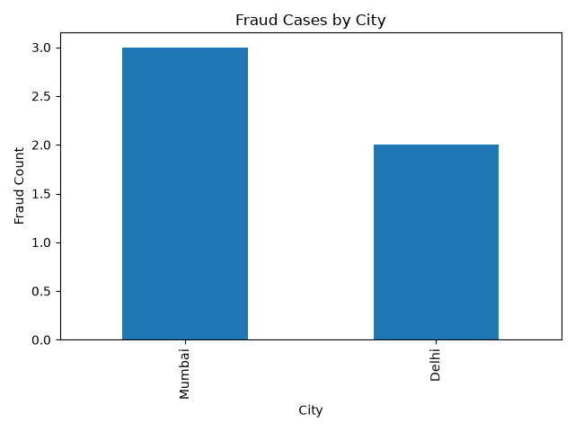
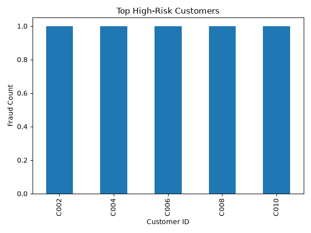

# Fraud Detection Analytics

## 📌 Project Overview

This project analyzes financial transaction data to identify fraudulent activities using Python. It performs data cleaning, fraud analysis, and visualization to uncover fraud patterns, high-risk customers, and city-wise fraud distribution.

---

## 🎯 Objectives

- Detect fraudulent transactions
- Identify high-risk customers
- Analyze fraud by city
- Generate summary reports
- Create visualizations for business insights

---

## 🛠 Technologies Used

- Python
- Pandas
- NumPy
- Matplotlib
- Git
- GitHub

---

## 📂 Project Structure

```
fraud-detection-analytics/
│
├── Data/
│   └── fraud_transactions.csv
│
├── output/
│   ├── fraud_summary.csv
│   ├── fraud_by_city.png
│   └── high_risk_customers.png
│
├── screenshots/
│   ├── fraud_by_city.png
│   └── high_risk_customers.png
│
├── fraud_analysis.py
├── requirements.txt
├── README.md
└── .gitignore
```

---

## 📊 Features

- Data Cleaning
- Fraud Detection Analysis
- High-Risk Customer Identification
- City-wise Fraud Analysis
- Summary Report Generation
- Automated Charts

---

## 📈 Output

### Fraud by City



### High Risk Customers




---

## 🚀 How to Run

1. Clone the repository

```bash
git clone https://github.com/roshinibhuma123-beep/fraud-detection-analytics.git
```

2. Install the required libraries

```bash
pip install -r requirements.txt
```

3. Run the project

```bash
python fraud_analysis.py
```

---

## 🔮 Future Improvements

- Power BI Dashboard
- Machine Learning Fraud Prediction
- Interactive Dashboard using Streamlit
- Real-Time Fraud Monitoring

---

## 👩‍💻 Author

**Roshini Bhuma**

GitHub: https://github.com/roshinibhuma123-beep